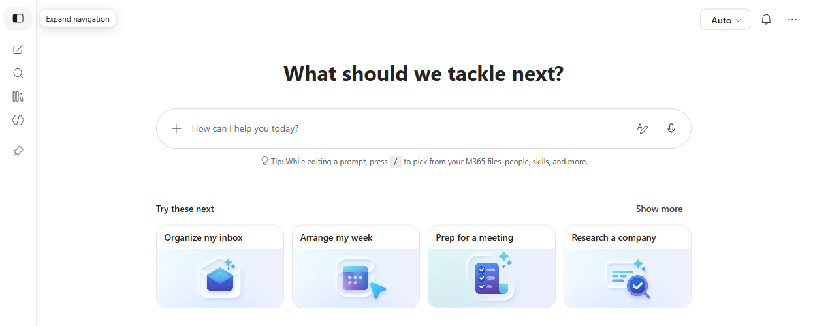
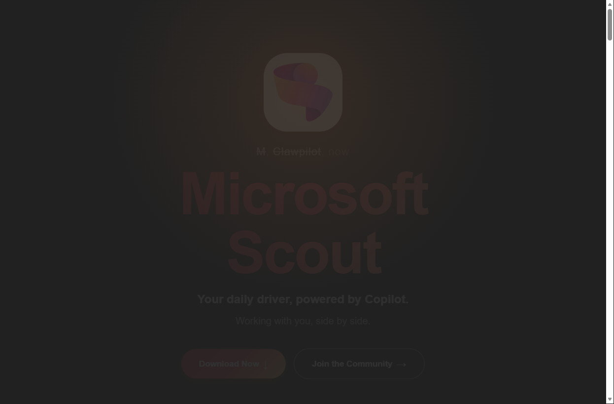
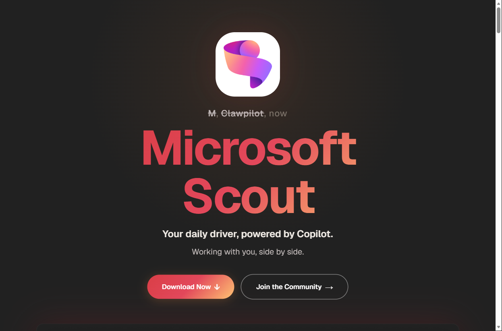
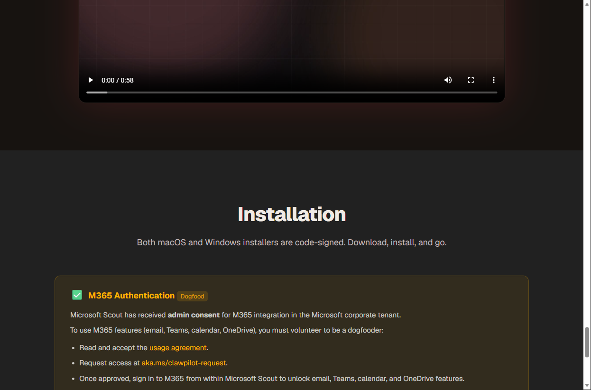
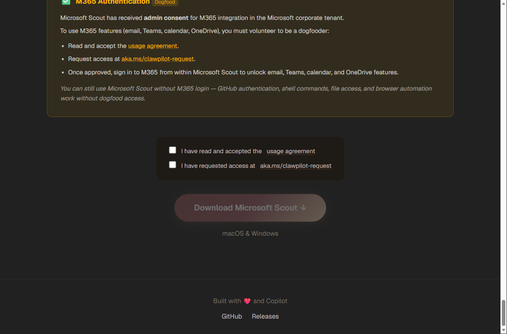

# Vibe Coding Workshop — Set up Copilot Cowork & Clawpilot

> 📅 **To do before the workshop.**
> This guide gets you ready to use **Copilot Cowork** (the agentic experience in Microsoft 365 Copilot)
> and **Clawpilot / Microsoft Scout**, the agentic desktop assistant (👉 [aka.ms/clawpilot](https://aka.ms/clawpilot)).
>
> Follow the 3 steps in order. Each step ends with a ✅ **Check**:
> once it passes, move on to the next one.

---

## 1. Prepare your Microsoft / Copilot access

📅 *To do before the workshop.*

### 👉 What is it?
Both Copilot Cowork and Clawpilot rely on your **Microsoft work account** (Microsoft 365 / Entra).
This account unlocks Copilot, your e-mail, your calendar and your files.
Each participant must use **their own work account**.

### Steps
1. **Sign in to Microsoft 365**
   - Open a browser
   - Go to: **[m365.cloud.microsoft](https://m365.cloud.microsoft)**
   - Sign in with your **work account** (not a personal account)

2. **Confirm Copilot access**
   - Once signed in, find the **Copilot** icon / tab at the top of the page
   - Click it: the Copilot chat window should open

### ✅ Check
Preparation is successful if:
- You are signed in to **m365.cloud.microsoft** with your work account
- The **Copilot** icon is visible and chat opens

👉 If so, move on to the next step.

---

## 2. Access Copilot Cowork

📅 *To do before the workshop.*

### 👉 What is it?
**Cowork** is the **agentic** mode of Microsoft 365 Copilot: instead of just answering,
Copilot **executes tasks end to end** for you (organize your inbox, prep for a meeting,
research a company, arrange your week…). It's like a teammate working right beside you.

### Steps
1. **Open Copilot**
   - From **[m365.cloud.microsoft](https://m365.cloud.microsoft)**, open the **Copilot** chat

2. **Select the Cowork agent**
   - In the **Agents** panel (left side), choose **Cowork**
   - The Cowork welcome screen appears: **"What should we tackle next?"**

   

3. **Run a test task**
   - Use a **"Try these next"** suggestion (e.g. *Organize my inbox*, *Arrange my week*,
     *Prep for a meeting*, *Research a company*) or type your own prompt
   - Let the agent work: it breaks the task down and shows its progress

### ✅ Check
Cowork access is successful if:
- The **Cowork** agent is selectable in the Agents panel
- The **"What should we tackle next?"** screen appears
- A test task runs and shows progress

👉 If so, move on to the next step.

---

## 3. Install and connect Clawpilot / Microsoft Scout (final step)

📅 *To do before the workshop.*

### 👉 What is it?
**Clawpilot** (product name: **Microsoft Scout**) is an **agentic desktop assistant**.
Unlike Copilot in the browser, it runs **on your machine** and can act on:
**your local files**, your **terminal / shell**, your **browser**, the **web**,
and your **Microsoft 365 data** (e-mail, Teams, calendar, OneDrive via WorkIQ).
This is the tool we'll use during the workshop for "vibe coding".

### Steps

**1. Open the download page**
   - Open a browser and go to: **👉 [aka.ms/clawpilot](https://aka.ms/clawpilot)**
   - You first land on **Single sign-on to Microsoft EMU** → click **Continue**

   

   - After authenticating, the **Microsoft Scout** home page appears

   

**2. Request M365 dogfood access (recommended)**
   - Scroll down to the **Installation** section
   - To use M365 features (e-mail, Teams, calendar, OneDrive) you must be a **dogfooder**:
     - Read and accept the **[usage agreement](https://aka.ms/clawpilot-agreement)**
     - Request access at **[aka.ms/clawpilot-request](https://aka.ms/clawpilot-request)**
   - ℹ️ *Without M365 login the app still works* (GitHub auth, shell, files, browser).

   

**3. Download the app**
   - Tick **both checkboxes** (usage agreement + access request)
   - The **Download Microsoft Scout** button enables → click it
   - Code-signed **macOS & Windows** installers are on the *Releases* page

   

**4. Install then open Clawpilot**
   - The download starts automatically (otherwise `Ctrl + J`)
   - Open the downloaded file and follow the steps (default options)
   - Launch the app: the welcome screen appears

**5. Sign in to Microsoft 365 in the app**
   - In Clawpilot, click **Sign in to M365**
   - Sign in with your **work account** and accept the permissions
   - Once approved (dogfood), you unlock e-mail, Teams, calendar and OneDrive

### ✅ Check
Installation is successful if:
- Clawpilot / Microsoft Scout opens correctly
- You are **signed in to Microsoft 365** (your name appears in the app)
- A simple test works, e.g.: `List my next 3 meetings`

👉 If so, **you're ready for the workshop!** 🎉

---

## 🧭 Summary

| Step | Tool | Goal | Done? |
|------|------|------|:-----:|
| 1 | Microsoft 365 | Copilot access with work account | ☐ |
| 2 | Copilot **Cowork** | Cowork agent selected | ☐ |
| 3 | **Clawpilot / Scout** | Desktop app installed & connected | ☐ |

## ❓ Troubleshooting
- **No Copilot access?** → contact your IT / the organizer to check your license.
- **Download button greyed out?** → make sure **both checkboxes** are ticked.
- **M365 sign-in fails in the app?** → confirm you're using your **work account** and that your **dogfood request** was approved.
- **Unsure about a permission?** → check the organization shown is **Microsoft** before accepting.

---

> ℹ️ Screenshots taken from the real pages (aka.ms/clawpilot and M365 Copilot). The Cowork "Recent" list was intentionally hidden for privacy.
